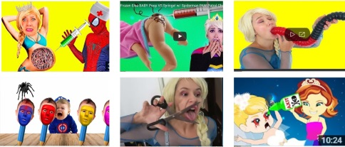
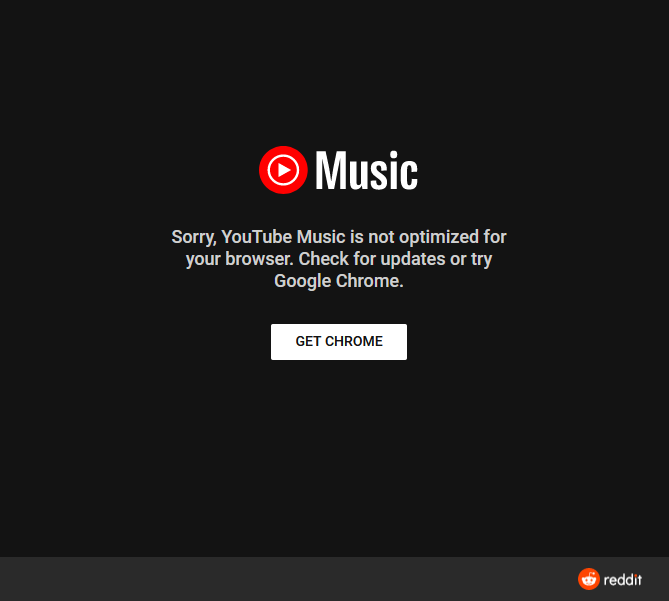

***

Read in a different language:

[ar عربى](README_AR.md) [zh-t 中國傳統的）](README_ZH-T.md)[**en-us**](README.md) [fr français](README_FR.md) [de Deutsch](README_DE.md) [ja 日本語](README_JA.md) [ko-south 韓國語](README_KO_SOUTH.md) [pl polski](README_PL.md) [ru русский](README_RU.md) [es en español](README_ES.md)

Translations in languages other than English are machine translated and are not yet accurate. No errors have been fixed yet as of February 17th 2021. Please report translation errors [here](https://github.com/seanpm2001/Stop-using-Chromebooks/issues/) look for the correct language translation thread. Make sure to backup your correction with sources and guide me, as I don't know languages other than English well (I plan on getting a translator eventually) please cite [wiktionary](https://en.wiktionary.org) and other sources in your report. Failing to do so will result in a rejection of the correction being published.

***

# Alternating from YouTube

This is an article on why you should work on trying to find alternates to YouTube. YouTube has been in an exponentially decaying state since 2009, and the platform keeps getting more unsafe, more illegal, and harder to get away from. In its current state, it is impossible to alternate from YouTube, so we as a community need to work on promoting other video sites and spreading the word. A lot of people are unaware of this, but YouTube has been owned by Google since October 9th 2006.

# WARNING

This article contains mild swearing and potentially offensive content.

***

# Index

[01.0 - Overview](#Overview)

[02.0 - Privacy](#Privacy)

[03.0 - Alternative solutions](#Alternate-solutions)

[04.0 - Problematic content](#Problematic-content)

> [04.0.1 - Elsagate](#Elsagate)

> [04.0.2 - Echo chamber and promotion of Nazism](#Echo-chamber-and-promotion-of-Nazism)

> [04.0.3 - Pornography and web cam livestreams](#Pornography-and-web-cam-livestreams)

[05.0 - No longer about the creator](#No-longer-about-the-creator)

[06.0 - Attempts to kill other browsers](#Attempts-to-kill-other-browsers)

[07.0 - Horrific moderation](#Horrific-moderation)

[08.0 - As a monopoly](#As-a-monopoly)

[09.0 - The adpocalypse (2016-Present)](#The-adpocalypse-(2016-Present))

[10.0 - Usage of DRM](#Usage-of-DRM)

[11.0 - Advertising](#Advertising)

> [11.0.1 - Double the ads](#Double-the-ads)

> [11.0.2 - Bad ad moderation](#Bad-ad-moderation)

> [11.0.3 - 2+ hour unskippable ads](#2+-hour-unskippable-ads)

> [11.0.4 - AdPocalypse](#AdPocalypse)

[12.0 - Fair use](#Fair-use)

> [12.0.1 - Where's the fair use (#WTFU)](#Where's-the-fair-use-(#WTFU))

> [12.0.2 - Nintendo copyright abuse](#Nintendo-copyright-abuse)

> [12.0.3 - Fox copyright abuse](#Fox-copyright-abuse)

> [12.0.4 - Viacom copyright abuse](#Viacom-copyright-abuse)

> [12.0.5 - UMG copyright abuse](#UMG-copyright-abuse)

[13.0 - Restrictions](#Restrictions)

> [13.0.1 - Reactions to video downloaders](#Reactions-to-video-downloaders)

> [13.0.2 - YouTube-DL Takedown (October 2020)](#YouTube-DL-Takedown-(October-2020))

> [13.0.3 - Past Google+ requirement](#Past-Google+-requirement)

> [13.0.4 - Credit card and personal ID requirement to watch videos](#Credit-card-and-personal-ID-requirement-to-watch-videos)

[14.0 - Features removed](#Features-removed)

> [14.0.1 - Full subscriber count](#Full-subscriber-count)

> [14.0.2 - Video creator](#Video-creator)

[15.0 - Other limitations](#Other-limitations)

> [15.0.1 - Monetization requirements](#Monetization-requirements)

[16.0 - Censorship](#Censorship)

> [16.0.1 - Programming content](#Programming-content)

> [16.0.2 - Pro-Hong Kong content](#Pro-Hong-Kong-content)

> [16.0.3 - No one hears your screams](#No-one-hears-your-screams)

[17.0 - Other things to check out](#Other-things-to-check-out)

[18.0 - Article info](#Article-info)

> [18.0.1 - Software status](#Software-status)

[19.0 - File history](#File-history)

[20.0 - Footer](#Footer)

***

## Overview

Like other Google products, YouTube has a history of privacy and performance issues.

General description [from Wikipedia: YouTube](https://en.wikipedia.org/wiki/Google_Classroom) - Data from Februry 17th 2021 at 4:50:02 pm (PT: Pacific Time)

YouTube is an American online video-sharing platform headquartered in San Bruno, California. The service, created in February 2005 by three former PayPal employees—Chad Hurley, Steve Chen, and Jawed Karim—was bought by Google in November 2006 for US$1.65 billion and now operates as one of the company's subsidiaries. YouTube is the second most-visited website after Google Search, according to Alexa Internet rankings.

YouTube allows users to upload, view, rate, share, add to playlists, report, comment on videos, and subscribe to other users. Available content includes video clips, TV show clips, music videos, short and documentary films, audio recordings, movie trailers, live streams, video blogging, short original videos, and educational videos. Most content is generated and uploaded by individuals, but media corporations including CBS, the BBC, Vevo, and Hulu offer some of their material via YouTube as part of the YouTube partnership program. Unregistered users can watch, but not upload, videos on the site, while registered users can upload an unlimited number of videos and add comments. Age-restricted videos are available only to registered users affirming themselves to be at least 18 years old.

As of May 2019, there were more than 500 hours of content uploaded to YouTube each minute and one billion hours of content being watched on YouTube every day. YouTube and selected creators earn advertising revenue from Google AdSense, a program that targets ads according to site content and audience. The vast majority of videos are free to view, but there are exceptions, including subscription-based premium channels, film rentals, as well as YouTube Music and YouTube Premium, subscription services respectively offering premium and ad-free music streaming, and ad-free access to all content, including exclusive content commissioned from notable personalities. Based on reported quarterly advertising revenue, YouTube is estimated to have US$15 billion in annual revenues.

YouTube has faced criticism over aspects of its operations, including its handling of copyrighted content contained within uploaded videos, its recommendation algorithms perpetuating videos that promote conspiracy theories and falsehoods, hosting videos ostensibly targeting children but containing violent or sexually suggestive content involving popular characters, videos of minors attracting pedophilic activities in their comment sections, and fluctuating policies on the types of content that is eligible to be monetized with advertising. 

***

## Privacy

[G](https://en.wikipedia.org/wiki/Criticism_of_Google)[o](https://en.wikipedia.org/wiki/PRISM_(surveillance_program))[o](https://www.reddit.com/r/degoogle/)[g](https://www.wired.com/2012/06/opinion-google-is-evil/)[l](https://securitygladiators.com/chrome-privacy-bad/)[e](https://www.zdnet.com/article/goodbye-google-why-and-how-to-take-back-your-privacy/) [h](https://www.theguardian.com/commentisfree/2018/mar/28/all-the-data-facebook-google-has-on-you-privacy)[a](https://www.vox.com/recode/2020/2/21/21146998/google-new-mexico-children-privacy-school-chromebook-lawsuit)[s](https://www.eff.org/deeplinks/2019/08/dont-play-googles-privacy-sandbox-1) [a](https://money.cnn.com/2017/10/11/technology/google-home-mini-security-flaw/index.html) [v](https://www.huffpost.com/entry/why-googles-spying-on-use_b_3530296)[e](https://medium.com/digiprivacy/i-stopped-using-google-as-my-search-engine-heres-why-7a3a1b4fef81)[r](https://www.theguardian.com/technology/2019/nov/05/fitbit-google-acquisition-health-data)[y](https://www.computerworld.com/article/3128791/how-google-homes-always-on-will-affect-privacy.html) [v](https://protonmail.com/blog/google-privacy-problem/)[e](https://www.forbes.com/sites/gordonkelly/2020/02/23/google-chrome-80-upgrade-deep-linking-update-chrome-browser/)[r](https://www.wired.co.uk/article/duckduckgo-google-alternative-search-privacy)[y](https://en.wikipedia.org/wiki/Nothing_to_hide_argument#Criticism) [b](https://spreadprivacy.com/three-reasons-why-the-nothing-to-hide-argument-is-flawed/)[a](https://eduzaurus.com/free-essay-samples/nothing-to-hide-argument-has-nothing-to-say/)[d](https://www.cnet.com/how-to/google-collects-a-frightening-amount-of-data-about-you-you-can-find-and-delete-it-now/) [r](https://www.nbcnews.com/tech/tech-news/google-sells-future-powered-your-personal-data-n870501)[e](https://www.eff.org/deeplinks/2020/03/google-says-it-doesnt-sell-your-data-heres-how-company-shares-monetizes-and)[c](https://www.wired.com/story/google-tracks-you-privacy/)[o](https://www.theguardian.com/commentisfree/2018/mar/28/all-the-data-facebook-google-has-on-you-privacy)[r](https://www.dailymail.co.uk/sciencetech/article-5743829/Googles-vision-TOTAL-data-collection-revealed.html)[d](https://www.reuters.com/article/us-alphabet-google-privacy-lawsuit-idUSKBN23933H) [w](https://www.wired.com/story/health-fitness-data-privacy/)[h](https://www.pcmag.com/news/google-sued-over-kids-data-collection-on-education-chromebooks)[e](https://mashable.com/article/google-android-data-collection-study/)[n](https://www.engadget.com/australian-government-google-data-collection-lawsuit-182043643.html) [i](https://www.maketecheasier.com/studyandroid-data-google-ios-apple/)[t](https://www.washingtonpost.com/technology/2019/07/23/never-googlers-web-users-take-ultimate-step-guard-their-data/) [c](https://www.cnn.com/2019/11/12/business/google-project-nightingale-ascension/index.html)[o](https://en.wikipedia.org/wiki/2018_Google_data_breach)[m](https://moz.com/blog/where-does-google-draw-the-data-collection-line)[e](https://mashable.com/article/google-android-data-collection-study/)[s](https://eandt.theiet.org/content/articles/2020/06/google-sued-over-data-collection-from-users-in-incognito-mode/) [t](https://www.nytimes.com/2019/01/21/technology/google-europe-gdpr-fine.html)[o](https://www.bloomberg.com/news/articles/2017-11-30/google-sued-over-data-claims-on-behalf-of-5-million-iphone-users) [u](https://time.com/23782/google-flu-trends-big-data-problems/)[s](https://www.reuters.com/article/dataprivacy-googleyoutube-kidsdata-idUSL1N2J306W)[e](https://www.adweek.com/performance-marketing/google-is-collecting-your-data-even-when-your-phone-isnt-in-use/)[r](https://www.computerworld.com/article/2914838/project-fi-will-help-google-amass-even-more-data-about-you.html) [p](https://topclassactions.com/lawsuit-settlements/privacy/google-says-class-action-lawsuit-plaintiffs-consented-to-data-collection/)[r](https://arstechnica.com/information-technology/2014/01/what-google-can-really-do-with-nest-or-really-nests-data/)[i](https://www.cbsnews.com/news/google-education-spies-on-collects-data-on-millions-of-kids-alleges-lawsuit-new-mexico-attorney-general/)[v](https://www.nationalreview.com/2018/04/the-student-data-mining-scandal-under-our-noses/)[a](https://www.wired.com/insights/2012/10/google-opt-out/)[c](https://www.nytimes.com/2019/09/04/technology/google-youtube-fine-ftc.html)[y](https://medium.com/@hansdezwart/during-world-war-ii-we-did-have-something-to-hide-40689565c550)[.](https://medium.com/digitalprivacywise/why-you-should-stop-using-google-chrome-6c934c9a827c) (I could go on and on with evidence of this, but it took a long time to find and go through all these articles)

Privacy on Google products is always bad, due to all Google products containing spyware. Google claims to not spy on school children anymore (unless the teachers turn the option on to do so) but Google cannot be trusted, and we can't know for sure, due to Google Classroom being closed source (proprietary) software.

No matter what you do, when you are using Google Classroom, all of your sensitive personal data is being sent to Google and others. Google has also been spotted going through open programs. For example, from personal experience (on Firefox) with a YouTube tab open that I didn't visit, I watched several videos offline (VLC Media Player) Later when I went to check the recommendations, it was nearly everything that I had watched. There is no doubt they are spying on other programs too.

In Chrome (and many other browsers) an incognito mode is present. In Chrome, this mode is pointless, as Google will still mine your data. Even if you turn data mining/tracking off, and enable the "do not track" signal, surprise suprise, Google is still mining your data.

If you think you have nothing to hide, **you are absolutely wrong**. This argument has been debunked many times over:

[Via Wikipedia](https://en.wikipedia.org/wiki/Nothing_to_hide_argument#Criticism)

1. Edward Snowden remarked "Arguing that you don't care about the right to privacy because you have nothing to hide is no different than saying you don't care about free speech because you have nothing to say. "When you say, ‘I have nothing to hide,’ you’re saying, ‘I don’t care about this right.’ You’re saying, ‘I don’t have this right, because I’ve got to the point where I have to justify it.’ The way rights work is, the government has to justify its intrusion into your rights."

2. Daniel J. Solove stated in an article for The Chronicle of Higher Education that he opposes the argument; he stated that a government can leak information about a person and cause damage to that person, or use information about a person to deny access to services even if a person did not actually engage in wrongdoing, and that a government can cause damage to one's personal life through making errors. Solove wrote "When engaged directly, the nothing-to-hide argument can ensnare, for it forces the debate to focus on its narrow understanding of privacy. But when confronted with the plurality of privacy problems implicated by government data collection and use beyond surveillance and disclosure, the nothing-to-hide argument, in the end, has nothing to say."

3. Adam D. Moore, author of Privacy Rights: Moral and Legal Foundations, argued, "it is the view that rights are resistant to cost/benefit or consequentialist sort of arguments. Here we are rejecting the view that privacy interests are the sorts of things that can be traded for security." He also stated that surveillance can disproportionately affect certain groups in society based on appearance, ethnicity, sexuality, and religion.

4. Bruce Schneier, a computer security expert and cryptographer, expressed opposition, citing Cardinal Richelieu's statement "If one would give me six lines written by the hand of the most honest man, I would find something in them to have him hanged", referring to how a state government can find aspects in a person's life in order to prosecute or blackmail that individual. Schneier also argued "Too many wrongly characterize the debate as 'security versus privacy.' The real choice is liberty versus control."

5. Harvey A. Silverglate estimated that the common person, on average, unknowingly commits three felonies a day in the US.

6. Emilio Mordini, philosopher and psychoanalyst, argued that the "nothing to hide" argument is inherently paradoxical. People do not need to have "something to hide" in order to hide "something". What is hidden is not necessarily relevant, claims Mordini. Instead, he argues an intimate area which can be both hidden and access-restricted is necessary since, psychologically speaking, we become individuals through the discovery that we could hide something to others.

7. Julian Assange stated "There is no killer answer yet. Jacob Appelbaum (@ioerror) has a clever response, asking people who say this to then hand him their phone unlocked and pull down their pants. My version of that is to say, 'well, if you're so boring then we shouldn't be talking to you, and neither should anyone else', but philosophically, the real answer is this: Mass surveillance is a mass structural change. When society goes bad, it's going to take you with it, even if you are the blandest person on earth."

8. Ignacio Cofone, law professor, argues that the argument is mistaken in its own terms because, whenever people disclose relevant information to others, they also disclose irrelevant information. This irrelevant information has privacy costs and can lead to other harms, such as discrimination.

Google has been using ChromeOS to illegally spy on, monitor, and steal data from school students all around the world. There have already been many lawsuits, and they aren't going to stop until ChromeOS dies out completely.

***

## Alternative solutions

Unfortunately, YouTube completely dominates the video market. Smart TVs don't have alternatives, and the alternates on other devices don't come close to being able to replace YouTube at the moment (due to YouTubes 13 billion+ videos)

Any uploads to other sites will help get away from YouTube.

Here are some alternates to YouTube:

* Vimeo (popular, but not nearly as popular as YouTube. Has over 1 million videos, payment is required to upload big video files or have lots of video uploaded per week)

* Dailymotion (the 2nd most popular video site to YouTube)

* BitTube (a much smaller alternative, friendly, but videos have a 3 hour limit)

* YouTube Vanced (not really an alternative, just a client for YouTube, but is worth mentioning. Vanced lets you get all the features of YouTube Red/Premium for free. YouTube Vanced has to be installed via an APK file and may require rooting your Android device. You should get help with installation through sources like [r/vanced](https://www.reddit.com/r/vanced) and remember that if you are paying anything for Vanced, even if it is just a penny, you are being scammed

* Invidious (popular YouTube alternate, although the original site invidio.us was taken down by Google)

* Reddit (not the best alternative, and not a full-on video site. Contains restrictions)

* TikTok (REALLY not a good alternative due to privacy and censorship issues, but it is a full-on video site. Contains many restrictions)

* Facebook (REALLY not a good alternative due to privacy and censorship issues, and is not a full-on video site. Contains many restrictions)

* Instagram (REALLY not a good alternative due to privacy and censorship issues, and is not a full-on video site. Contains many restrictions)

* Newgrounds (Going strong since 1996, and hosts more than just videos (games, images, music and more) extremely functional and user friendly

[Suggest more alternatives through a GitHub issue](https://github.com/seanpm2001/Alternating-from-YouTube/issues)

***

## Problematic content

YouTube has a long history of hosting problematic content. Google does nothing about these problems until they get so bad that it starts generating high level bad press, then they half-ass their fix to the problem, which only mitigates less than 1% of the problematic content, and still continues to scar people for life.

### Elsagate

Elsagate is an ongoing content trend on YouTube that started around 2014. Elsagate content ranges on a spectrum from mildly bad to borderline illegal worldwide. Elsagate content picks up on key topics that parents/kids search for. The thumbnail may be innocent, or it could be disturbing (see above) but the content in the video is always much worse.

Elsagate thumbnails typically involve a yellow background (as it catches the eye very easily) and uses an assortment of colors. The video titles are a horrific mess, and the descriptions contain hundreds of tags to get more kids to watch. Some common title tags include "learn colors" "finger family puppet time" but they don't always have this tag.

The content in these videos is traumatizing to young children and can pervert the mind at a very young age. Elsagate videos normally contain popular cartoon characters, starting innocent, but then turning into them getting injected, eating [fecal matter](https://en.wikipedia.org/wiki/Feces) getting raped, giving birth, getting assaulted/killed, and more.

There is an alarming number of users on YouTube under the age of 13 (the minimum age) and people under 13 are YouTubes main demographic. These videos also use view bots to gain additional millions of views, but a large number of these views are also from children watching it.

The controversy ran without criticism until 2017 when it gained media coverage. The term Elsagate came from the common theme of using Disney characters, most notably Spider-Man and [Elsa](https://en.wikipedia.org/wiki/Elsa_(Frozen)) YouTube started responding to the issue, but not enough was done. Google doesn't respond very frequently to it until it generates bad press. Google has been given many "small" fines for these violations (a $5,000,000.00 to $5,000,000,000.00 fine is very small for a company like Google, it is basically just a drop in the bucket) some of Googles responses was taking down a few of the offending videos, while still leaving hundreds of thousands of these videos on the site. Other changes include disabling comments on any video that the YouTube algorithm thinks is associated with a kids video (sometimes even when it is not a kids video) due to the constant spamming of gibberish, and Syro-Arabian (Arabic, Hindi, etc.) language comments. Some comments were luring children into dangerous situations.

YouTube KIds was one of Googles attempted solutions to the Elsagate problem, with childrens content being on YouTube kids. A huge problem with this is that Google still applies these rules to the main YouTube site, and video creators are punished for using swear words. Elsagate content is still present on the YouTube kids app, among other things. One notable example is a Christian video of a man and a woman having anal sex. This was an uncensored video that not only got age-restricted, but was moderated and approved (the video was age restricted, but also had the YouTube kids rules, such as disabling content "for content made for kids") a big lesson on this is to not be such a lazy parent, and monitor what your kids watch if you decide to let them have Internet access so early, as they could be watching things that could traumatize and change them.

See more [Wikipedia](https://en.wikipedia.org/wiki/Elsagate) [Other/Unknown](https://www.example.com)

### Echo chamber and promotion of Nazism

YouTubes search engine is designed to keep the user engaged for long periods of time. It is sometimes used to radicalize its users.

When watching news or political videos, it is very common for anti-semetic and other hateful content to be recommended right next to the video. At the same time, most history channels are being punished for using uncensored history, notable examples being the Swastika and Confederate Flags having to be modified to remove the symbols for the video to not get taken down.

### Pornography and web cam livestreams

Despite YouTubes moderation, Pornography is still making its way past the filters. It is in the search results, in the recommended, and sometimes even in the advertisements.

Some results that will give you these problematic results include `s3xy` etc.

## No longer about the creator

YouTube has been waning from "broadcast yourself" to "go fuck yourself" for a number of years, notably from 2009 and onward. In 2020, the Indian Bollywood music channel T-series overtook the most subscribed creator at the time (PewDiePie) of the spot. Most of the top YouTube channels are businesses, and not everyday content creators.

## Attempts to kill other browsers

Google is anti-competitive, because they know any successful competition will make them go bankrupt and have to close down their business. Whenever Google gets the chance, they will force their users away from other web browsers (such as Firefox, Safari, Microsoft Edge, etc.) and towards Chrome.

This is an example of their anti-competitive behavior in practice.

## Horrific moderation

YouTube has had extremely poor moderation for many years. Since 2012, the website is moderated by a poorly designed Artificial Intelligence (AI) this results in the issue that your video, channel, or playlist can be taken down at any time, for no reason at all. You also can't repeal, unless you have enough Twitter followers and supporters to get the attention of the YouTube Twitter account, in which you still won't always get your channel, playlist, or video re-instated. 

## As a monopoly

YouTube is a monopoly on the video market. Over 500 hours of content is uploaded per minute, and the site has an estimated 13,000,000,000+ videos. As a result, YouTube is a video monopoly that you currently can't escape from. There are other video sites (such as Vimeo, Dailymotion, BitTube, TikTok, etc.) but they come nowhere close to the amount of video coverage as YouTube. A common issue in trying to switch to another platform is the fact that most of the content creators you watch aren't there.

## The adpocalypse (2016-Present)

In 2016, with a rise of drama-based channels that cyberbullied people (sometimes to the point of suicide) along with various controversies starting to gain steam at the time (such as Elsagate) YouTube began a new monetization system. As of 2021, there is still no criteria on what an "advertiser friendly video" is, but videos are still stripped of their monetization rights, as they violate this rule. The dubbed adpocalypse really started when several large brands (such as Pepsi) pulled their advertisements from YouTube. The fears of being demonetized caused the quality of content to go down drastically, as users could get their video demonetized for small things, like saying any swear word. These changes made the content of top channels like PewDiePie go down exponentially.

In 2017, the monetization system was updated: a green dollar sign meant you get full ad revenue, a yellow dollar sign meant you only got a portion of it, a black crossed out dollar sign meant you didn't get any ad revenue, but if the video got claimed, the claimee could still make money off your video.

Later on, the requirement for monetization went up drastically, to the point where you needed to gain at least 1000 subscribers in 1 year, and have over 4000 hours (14400000 seconds) of watch time on your channel in 1 year to apply for monetization.

## Usage of DRM

For most of YouTubes history, light DRM has been in use, which doesn't require [WideVine](https://github.com/seanpm2001/Its-time-to-cut-WideVine-DRM) to be installed, but still restricts you from unlocking the video player to download the video itself. This issue is mitigated with the use of video downloading software such as VideoDownloadHelper, YouTube-DL, YouTubeMP3, Y2Mate, downloadyoutubehd, VLC Media Player, and many others.

## Advertising

YouTube originally didn't have advertisements. This was added early on. Originally, most videos only had a maximum of 1 ad per portion of the video.

### Double the ads

In the late 2010s, YouTube videos had their ads doubled, meaning you had to deal with 2 ads at the start of video, and on each ad break (although not always) this has been widely criticized. You can bypass this by downloading a good plugin/addon that can block ads, like ublock origin (note: don't get ublock, get ublock Origin, just ublock isn't developed well, and has had many controversies)

### Bad ad moderation

Moderation of advertisements on YouTube has been getting increasingly worse. Pornographic and gory ads are allowed when they can bypass the filter, and many people under the age of 13 have been using their mom's credit card (or another payment method) to post their own ads on YouTube, which can be anything they want, even if it is just 24 minutes of Minecraft gameplay.

On mobile, game advertisements are generated en masse by bot software, and tons of bad ads are present on YouTube (such as ads for Homescapes by Playrix, various Mario clones, ads with bad captions like "Mom vs Dad" "Why is this game so hard?" "Only 0.00001% people can solve" and others)

### 2+ hour unskippable ads

On YouTube, there are ads that are longer than 2 hours in duration. Although extremely rare (normally only visible through search results) there is still a chance you might get a 2+ hour unskippable ad that you have to watch for 2 hours before you can watch any videos again (at this point, either stop using YouTube or get an ad blocker immediately)

### AdPocalypse

[See above](#The-adpocalypse-(2016-Present))

## Fair use

Fair use of content is not common on YouTube.

### Where's the fair use (#WTFU)

A common hashtag that is used when fair use is abused on YouTube is `#WTFU` which doesn't stand for "What The Fuck UTube" but actually stands for "Where's The Fair Use"

### Nintendo copyright abuse

Nintendo is a common abuser of copyright. Nintendo has a history of taking down fan creations and sending out barrages of Cease and Desist letters. On YouTube, Nintendo requires the use of a Nintendo license to post content to the site that contains Nintendo imagery. This license costs money, and doesn't work entirely.

Nintendo's biggest target on YouTube is music. Nintendo has taken down hundreds of thousands of videos for the use of Mario, Zelda, Pokémon, etc. music in videos. Nintendo does not offer a way to listen to their older music legally (unless you want to spend hundreds of thousands buying old games from scalpers and getting old consoles) and they have taken down many channels that have Nintendo music.

One common controversy was the takedown of the BrawlM3STR [sic] channel. This channel contained over 24000 videos of extended music, and had over 13 billion views at the time of the beginning of deletion. In the late 2010s, YouTube gave the channel a warning to stop using their music. Brawl complied and deleted all the Nintendo music from his channel, which also deleted over 12 billion views. However, 3 months later, even after all Nintendo music was deleted, Nintendo still successfully deleted his channel. He had been on the site for over 10 years.

Another common issue is that you can't recreate Nintendo songs. Just humming the Super Mario Bros (1985) theme song can get your video taken down.

### Fox copyright abuse

20th century fox is another copyright abuser on YouTube. Fox will take down any video or post that shows their content (even if it is just a 5 second GIF with no sound, I did this myself a long time ago, and got a copyright strike within 20 hours) 

Another notable example is when the show Family Guy used a random gameplay video on their show and didn't credit the creator. In the episode, the video was used in full with very little commentary added on. The video had been on YouTube for over 6 years. They didn't stop there. Fox managed to give the creator a copyright strike for their use of his video on their show. This caused significant controversy, and the creator of the show (Seth MacFarlane) stepped in and got the video reinstated. However, the video is still claimed by Fox, and they receive all revenue from it.

### Viacom copyright abuse

Viacom (owner of Nickelodeon and various other media) is one of the most significant copyright abusers on YouTube. Back in the early 2000s, when YouTube was starting to gain popularity, Viacom sued Google for over 1 billion dollars for the use of SpongeBob and other characters in videos. The decision to comply was the start of the copyright abuse and fair use removal on YouTube.

### UMG copyright abuse

UMG (Universal Music Group) is one of the biggest copyright holders on YouTube. UMG owns all Vevo videos, along with many other music videos. UMG commonly strikes people for using their music in a video, even for the shortest amount of time. Most of the time, they don't take down the video, but claim it, so they get all revenue from the video and the creator doesn't (even if the creator isn't eligable for monetization)

## Restrictions

YouTube has many restrictions.

### Reactions to video downloaders

YouTube has been going after video downloading software that downloads from YouTube for many years. There have been many attempts to remove them, but there are too many to go against. Even if all the websites that download videos are gone, there will always be programs like VLC Media Player, and hopefully YouTube-dl. Google goes out of their way to change the system monthly so that video downloaders have to be reprogrammed to download videos. Google puts the majority of their resources into this rather than to moderate their site.

### YouTube-DL Takedown (October 2020)

In October of 2020, the RIAA got upset about YouTube-DLs existance and sent a DMCA claim to GitHub to remove the repository and it worked. They continued to fight anyone sharing the source code while they had a poor legal battle. The legal battle was a significant embarrassment to the RIAA, as the EFF (Electronic Frontiers Foundation) fought back with a countersuit, costing nearly a million dollars in court fees. The EFF was so confident in winning that they used various Lord of the Rings jokes in their legal claims. The claim was that YouTube-DL was a tool for activism, and not just for "infringing on their copyrights" The RIAA lost, and the repository was re-instated.

### Past Google+ requirement

Back in 2011, Google was trying to promote their alternate Google+ platform. YouTube users were required to create a Google+ account along with their YouTube account to upload videos, leave likes/dislikes, and post comments. This did little to help the Google+ platform, and many criticized it, including one of the original developers of YouTube.

### Credit card and personal ID requirement to watch videos

Starting in 2021, Google began requiring its users to give them their credit card information or personal ID to watch any age-restricted video (even if the video was age-restricted falsely, Google has a poorly enforced pornography ban on YouTube, but that isn't what is normally being restricted to the user (English problem))

You can still watch age-restricted videos without giving out sensitive information, a top strategy would be to download YouTube-DL and download the problematic video, as YouTube-DL bypasses the age block. 

## Features removed

Google has removed many features from YouTube over the years.

### Full subscriber count

Due to issues with creators making bad choices and getting upset by losing record numbers of subscribers, Google came to their aid and hid the full subscriber count. Live sub-counts are no longer possible due to this.

Here is how it changed:

**Original:** `1,199 subscribers` **Changed to:** `1.1k subscribers`

**Original:** `9,999,999 subscribers` **Changed to:** `9.9M subscribers`

and so on.

### Video creator

In 2017, YouTube removed the built-in video creator.

## Other limitations

Here are some other limitations to the YouTube platform.

### Monetization requirements

Starting in 2017, the requirements for monetization went from having 10000 views to:

* Gaining 1000 subscribers in 12 months

AND

* Having at least 4000 hours (166.67 days) of watch time in 12 months

## Censorship

YouTube is a censored site.

### Programming content

Starting in 2020, YouTube started taking down programming and computer-science related content due to "unethical hacking" just simply installing Linux or opening a terminal can get your video taken down (3 offenses lead to your entire channel being deleted)

### Pro-Hong Kong content

In October 2019 onward, YouTube censors any pro-Hong Kong content (content supporting the protests in Hong Kong china) typing `共匪` or `五毛` resulted in your comment being immediately deleted, although there was no community guidelines strikes given for this. Meanwhile, you can say the N word, or have the N word in your username all you want with zero consequence, along with other hateful things.

### No one hears your screams

If Google begins censoring you, there is no way to reach them. Unless you have a big enough following, no-one will hear your cries for help.

***

## Other things to check out

[The Google Graveyard (killedbygoogle.com) - a sorted list of the 224+ products Google has killed](https://killedbygoogle.com/)

> [GitHub link](https://github.com/codyogden/killedbygoogle)

[Alphabet worker union - The new workers union at Google with over 800 members](https://alphabetworkersunion.org/people/our-union/)

[Don't want to part with the dinosaur easter egg? This website has you covered](https://chromedino.com/)

There are other alternates, just search for them.

***

Some fact checking is needed for this article

***

## Article info

File type: `Markdown (*.md)`

File version: `1 (Wednesday, February 17th 2021 at 6:40 pm)`

Line count (including blank lines and compiler line): `543`

### Software status

All of my works are free from restrictions. DRM (**D**igital **R**estrictions **M**anagement) is not present in any of my works. This project does not contain any DRM

This sticker is supported by the Free Software Foundation. I never intend to include DRM in my works.

## File history

Version 1 (Wednesday, February 17th 2021 at 6:40 pm)

> Changes:

> * Started the file/article

> * Added the title section

> * Referenced several images

> * Added a section about privacy

> * Added a section about the overview

> * Added the article info section

> * Referenced the DRM Free icon

> * Added the file history section

> * Added the alternative solutions section

> * Added the problematic content section

> > * Added the Elsagate subsection

> > * Added the Echo chamber and promotion of Nazism subsection

> > * Added the pornography and web cam livestreams subsection

> * Added the No longer about the creator section

> * Added the Attempts to kill other browsers section

> * Added the Horrific moderation section

> * Added the As a monopoly section

> * Added the The adpocalypse (2016-Present) section

> * Added the Usage of DRM section

> * Added the Advertising section

> > * Added the Double the ads subsection

> > * Added the Bad ad moderation subsection

> > * Added the 2+ hour unskippable ads subsection

> > * Added the AdPocalypse subsection

> * Added the Fair use section

> > * Added the Where's the fair use (#WTFU) subsection

> > * Added the Nintendo copyright abuse subsection

> > * Added the Fox copyright abuse subsection

> > * Added the Viacom copyright abuse subsection

> > * Added the UMG copyright abuse subsection

> * Added the Restrictions section

> > * Added the Reactions to video downloaders subsection

> > * Added the YouTube-DL Takedown (October 2020) subsection

> > * Added the Past Google+ requirement subsection

> > * Added the Credit card and personal ID requirement to watch videos subsection

> * Added the Features removed section

> > * Added the Full subscriber count subsection

> > * Added the Video creator subsection

> * Added the Other limitations section

> > * Added the Monetization requirements subsection

> * Added the Censorship section

> > * Added the Programming content subsection

> > * Added the Pro-Hong Kong content subsection

> > * Added the No one hears your screams subsection

> * Added the other things to check out section

> * Added the index

> * Added the footer

> * No other changes in version 1

Version 2 (Coming soon)

> Changes:

> * Coming soon

> * No other changes in version 2

***

## Footer

You have reached the end of this file!

### EOF

***
